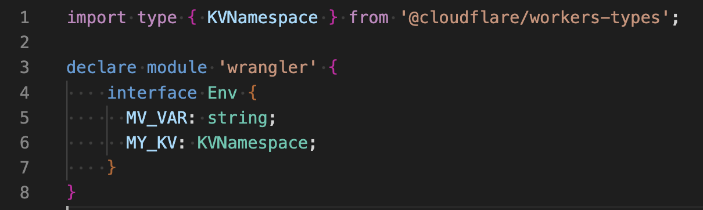
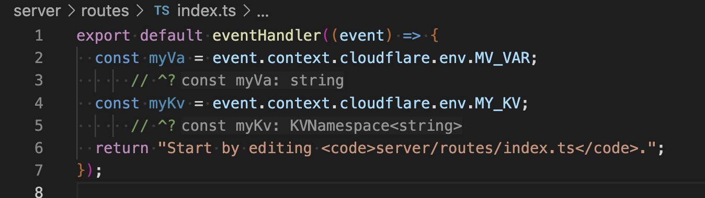

# Nitro generic `wrangler` `Env` type example

This is a minimal example showing how the `Env` type introduced in `wrangler` in [`workers-sdk/#5363`](https://github.com/cloudflare/workers-sdk/pull/5363) can be used to easily customize the type of the `env` object that [`nitro-cloudflare-dev`](https://github.com/pi0/nitro-cloudflare-dev) exposes.

All that is needed to customize the type of the `env` object is by adding to the `wrangler` `env` interface declaration the desired types, like so for example:


Afterwards the `env` object present on the h3 event object should include the correct types:


## Instructions

- Install the dependencies (using `pnpm`)
  ```
  $ pnpm i
  ```

- Tweak the type `Env` interface in `types.d.ts`

- See how such types get correctly inferred in `server/routes/index.ts`